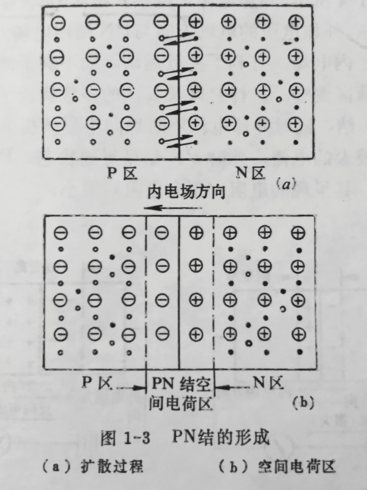
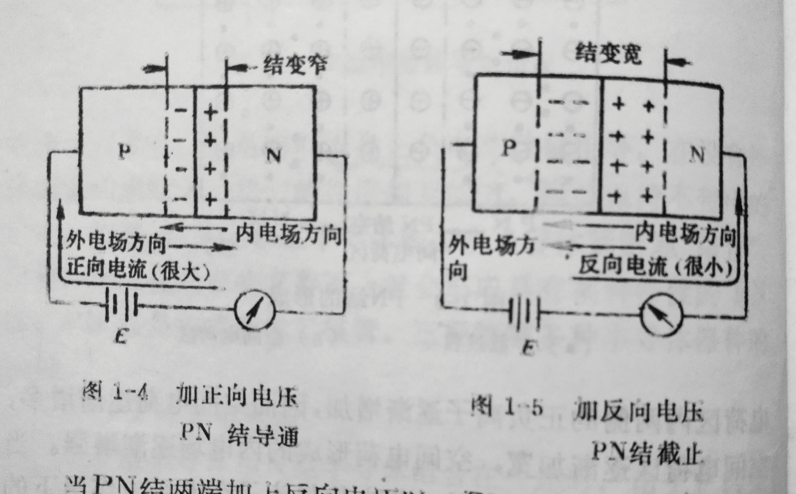

# 第一章 半导体器件及其特性

半导体器件是组成半导体电路的核心元件。各种半导体电路的性能与其所用器件的特性有密切的关系，因此，学习半导体电路，必须首先了解半导体器件的工作原理，掌握其工作特性和参数。半导体器件的种类很多，一般地说，由半导体材料制成的二极管、三极管和集成电路等，统称为半导体器件。本章只讨论半导体二极管和三极管，其它器件以后逐步介绍。

## 第一节  半导体基本知识

世界上有许多物质，就其导电性能而言，大体可分为导体、半导体和绝缘体。对于导体和绝缘体，大家都已有所了解，这里，我们只讨论半导体。顾名思义，半导体是一种导电能力介于导体和绝缘体之间的物质，其电阻率一般为10-3Ω0Ω·cm之间。然而半导体材料之所以受到人们重视，主要原因在于它的导电能力具有独特的性质。（1)热敏性：半电阻率因光照的增加而明显下降；（3)掺杂性：半导体的电阻率受“杂质”影响极大，即使掺入极微量的杂质，其电阻率也将大大降低。人们正是利用半导体的这些独特的导电性能，制造出许多不同性质、不同用途的半导体器件，从而使半导体成为电子技术的重要材料。

下面，对半导体的导电特性作具体分析。
### 一、本征半导体导电情况
纯净的单晶半导体，既不含任何杂质、也没有结构上的缺陷，称为本征半导体。有一定电量且能在电场力作用下自由运动的粒子，称为载流子物体内载流子的浓度和运动速度，决定着物体的导电能力。半导体中除了自由电子作为载流子之外，还存在另一种称为空穴的载流子。空穴和自由电子同时参加导电，这是半导体的重要特点。

在本征半导体中，激出一个自由电子，同时便产生一个空穴，电子和空穴总是成对地产生，称为电子空穴对。半导体中产生电子空穴对的过程叫本征激发。除了加热之外，用光或其它射线照射半导体，也能产生本征激发。空穴也能够运动，不过它的运动方式和自由电子的运动方式完全不同。空穴的运动实质上是填补空位运动的结果。

半导体由于热激发而不断产生电子空穴对，那么，电子空穴对是否会越来越多，电子和空穴的浓度是否会越来越大呢？实验表明，在一定的温度下，电子浓度和空穴浓度都保持一个定值。这是因为半导体中一方面存在载流子的产生过程，同时还存在另一个过程，那就是自由电子在运动中释放能量而填入空穴，于是电子空穴对消失的过程。这个过程称为载流子的复合过程。当产生率等于复合率时，载流子的浓度达到平衡。载流子的平衡浓度与温度有关。室温下，本征半导体中电子和空穴的平衡浓度很小，所以电导率很低。温度升高时，载流子浓度迅速增大，电导率也随之增大。
### 二、N型半导体和P型半导体

本征半导体的导电能力差，用途不广。采用掺杂工艺在本征半导体中掺入少量某种有用的元素，可改变载流子的浓度及半导体的导电能力。掺杂半导体统称杂质半导体，它分为N型半导体和P型半导体两类。

#### （一）N型半导体

在本征半导体中加入微量的五价元素（如砷，磷，锑等）：可使半导体中自由电子浓度大为增加，形成N型半导体

N型半导体中自由电子比空穴多几个数量级。自由电子称为多数载流子，空穴称为少数载流子。而杂质原子电离后产生的正离子均匀地分布在晶格中，不能自由运动，不是载流子。

N型半导体加上外加电压后，产生的电流主要是电子电流，其导电情况见图1-1.

#### （二）P型半导体

在本征半导体中加入微量的三价元素（如硼、铝、铟、镓等），可使半导体中的空穴浓度大为增加，形成P型半导体

P型半导体中空穴是多数载流子，电子是少数载流子，加电压后主要是引起带正电荷的空穴运动，形成空穴电流，其导电情况见图1-2.

### 三、PN 结及其单向导电性

不论是N型半导体还是P型半导体，它们虽然各有一种



载流子占多数，但是它们本身正负电荷数是相等。在没有外界因素的影晌下，它们的作用相互抵消，因此保持不带电的中性。但是，如果把P型半导体和N型半导体紫密地“结合”起来，那么在两者的交界面上就会形成具有某种特性的 PN结PN 结是构成品体二极管、三极管等多种半导体器件的基础。

###  (一）PN 结的形成

当P型半导体和N型半导体结合在一起时，由于卫区空六浓度高，N区电子浓度高，P区的空穴就要穿过交界面向N区扩散，同样，N区的电子也婴穿过交界面向P区扩散，如图1-3（a）所示。随着扩散的进行，在交界面附近，P区和N区中原来的电中性条件被破坏，使交界面两侧分别出现带电荷的薄层。P区失去空穴留下带负电的离子薄层，N区失去电子留下带正电的离子薄层。我们把这一层很薄的区域“空间电荷区”，如图 1-3（b）所示，PN结就是指这个区域。

扩散开始时，扩散运动占优势。随着扩散的进行，空间电荷区电荷区内两侧的正负离子逐渐增加，因而空间电荷逐渐增多，空间电荷区逐渐加宽，空间电荷形成的内电场逐渐增强。当内电场加强到一定程度时，使少数載流子在电场力作用下的定向运动〈即漂移运动）有明显的增加，同时使扩散运动明显减弱。最后，当扩散和漂移运动达到平衡时，扩散的载流王等于漂移的載流子数目，空间电荷区的宽度不再增加，达到动态平衡，PN 结就处于相对稳定状态。
###  (二）PN 结的单向导电性
当PN 结两端加上不同极性的直流电压时，其导电性能将产生很大差异。这就是 PN结的单向导电性。
当PN结两端加上正向电压时，PN结处于导通状态。

如图1-4所示，外加电源正极接P型区，负极接N型区，称正向电压。外加电压的电场方向与pn结内电场方向相反，因而削弱了内电场有利于扩散运动，而不利于漂移运动，使空间电荷区变窄这样p区与N区的多数载流子就能顺利通过Pn结，同时外部电源不断的向半导体提供空穴与电子，形成较大的电流，此时pn接结呈导通状态。pn结接正向电压时，其呈现的电阻（正向电阻）很小。
当pn结两端加上反向电压时，pn结处于截止状态。

如图所示1-5所示，外加电源正极接N型区，负极接P型区，称反向电压。这时外电场方向与内电场方向一致，使内电场加强，阻挡层加宽，阻止扩散运动的进行，有利于漂移运动的进行，此时少数载流子穿过pn结而形成的电流称为反向电流，此时pn接结呈截止状态。pn结接反向电压时呈现的电阻极大（称反向电阻），远远大于正向电阻。